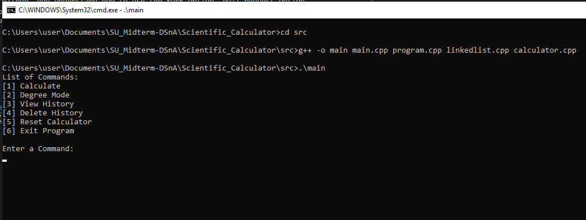
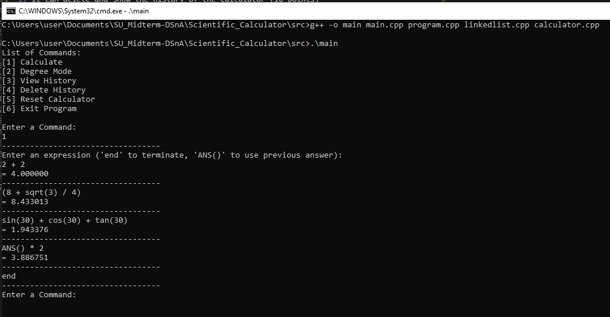
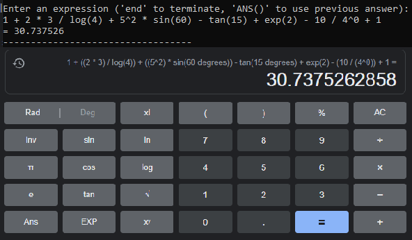
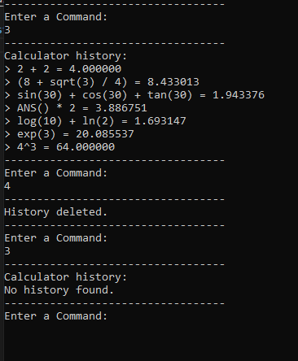

# Scientific Calculator
by Edrick, **Mikha**, Roger  
COMP2424-A Data Structures & Algorithms  
Mr. Muhamad Rausyan Fikri  
Date of Submission: 14 October 2021

## Project Goals

Please create a scientific calculator using c++, with the rules below:
1. The calculator should have + - / :   (10 points)
1. Basic trigonometry function: sin cos tan (10 points)
1. More than basic function: square root, exp, log, ln (15 points)
1. The calculator can input up to 10 or more variables and parameters. It is not  limited to 2 + 2, 3 x 3, etc. (15 points)
1. Inside the code, you apply the class function (separate class, inline class, constructor, etc.) (20 points)
1. Inside the code, you apply the linked list or queue function (20 points)
1. It can delete and show the history of the calculator (10 points)

The teamwork section is based on Github, which the score will be:
1. Using Github, you understand how to use the fork option, pull request option. 
1. Teamwork on solving the problem. In your report, you must state the person in charge. Please make sure each member has an equivalent contribution.

## Clone Line
```
> git clone https://github.com/MikhaWy/Scientific_Calculator.git
```
## Compile Line
```
> cd src
> g++ -o main main.cpp calculator.cpp linkedlist.cpp program.cpp
> .\main
```

## Sample Output 


## Sample Input
### 1. Calculation Command



### 2. Complex Expression


### 3. History Command

